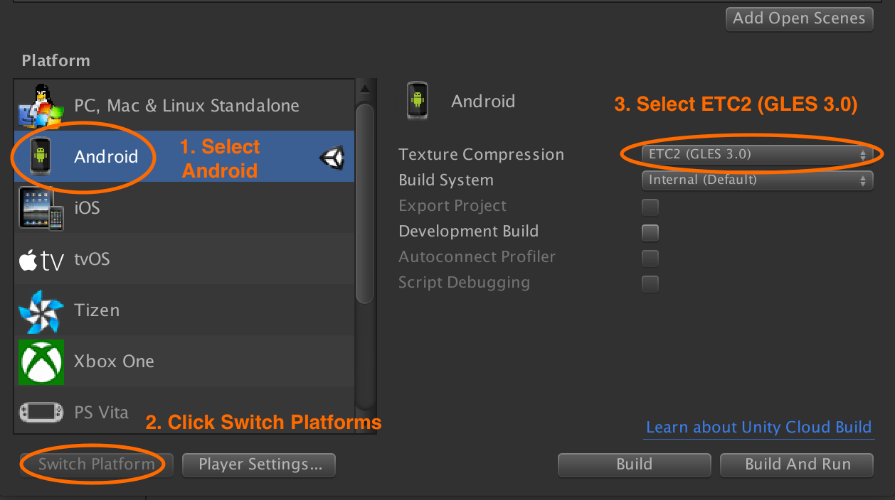
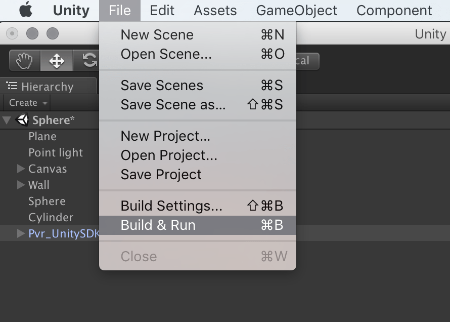

# Creating Unity builds for the Pico Goblin

## Build settings

Building directly to a Pico headset is the recommended method of running your app.

As the Pico operating system is an Android derivative, the build platform for your project must be set to **Android**.

This can be done via the **File › Build Settings** menu option.

Select **Android** and then click the **Switch Platform** button.

Change the **Texture Compression** option to **ETC2 (GLES 3.0)**.

Make sure the  **Build System** is set to **Internal**.

  

## Building directly to the Pico Goblin

> Before you attempt to build to the Pico Goblin device, ensure [you have enabled USB debugging](/docs/pico-goblin-developer-mode-usb-debugging.md).

Connect your charged Pico device via USB to your development machine and then select the **File › Build & Run** menu option in Unity.

  

Your app should then be installed and launched on the device.

## Building an APK

Select the **File › Build Settings** menu option in Unity.

Click the **Build** button and select where you would like to save the APK on your file system.

## Next: Troubleshooting

See [common problems](/docs/troubleshooting.md).
