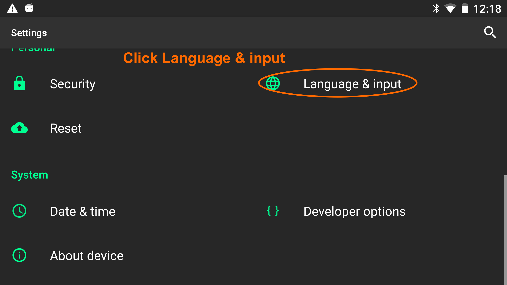
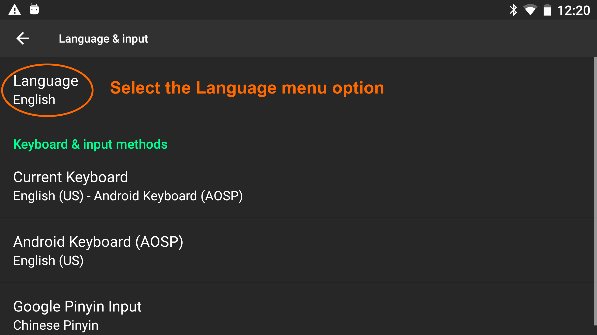
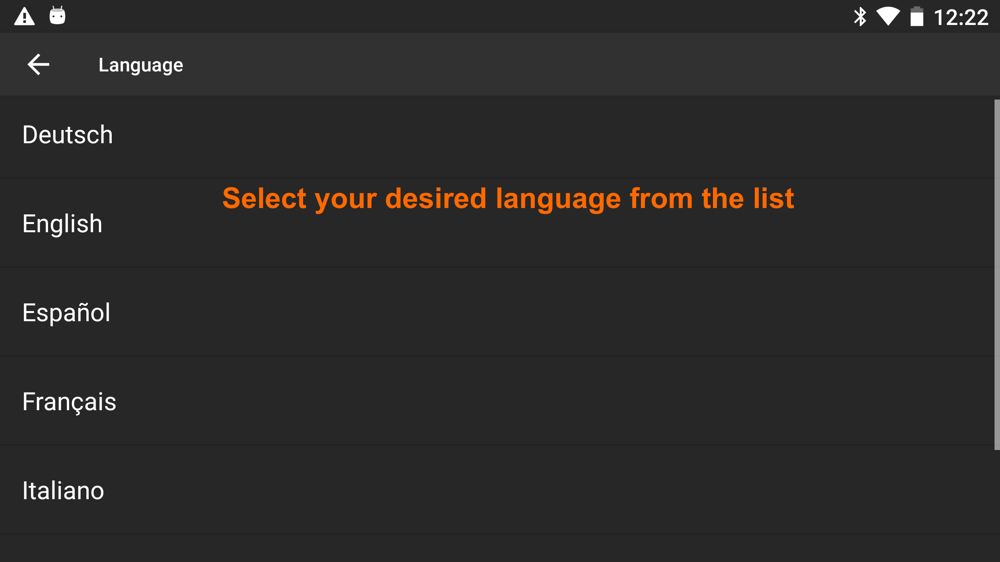

# Changing a Pico Goblin's language setting

> The following instructions demonstrate the Pico Goblin with its language set to English. However, because the button and menu item positions remain the same when the language is changed, they can be used with any of the supported languages.

On the Pico Goblin device's home screen, select the **Settings** option on the right of the screen:

  

Select the **Developer** or **Advanced Options**:

  

Scroll down and select the **Language & Input** option:

  

Select the **Language** menu option:

  

Select your desired language from the list. (You can refer to [What languages do I need?](/docs/pico-unity-localization.md#what-languages-do-i-need?) for the full list in English.)

  

