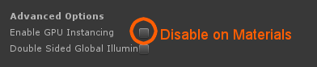
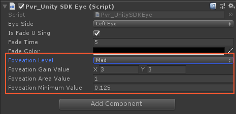
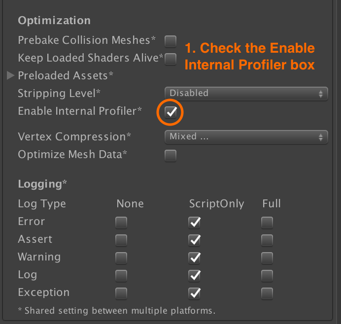
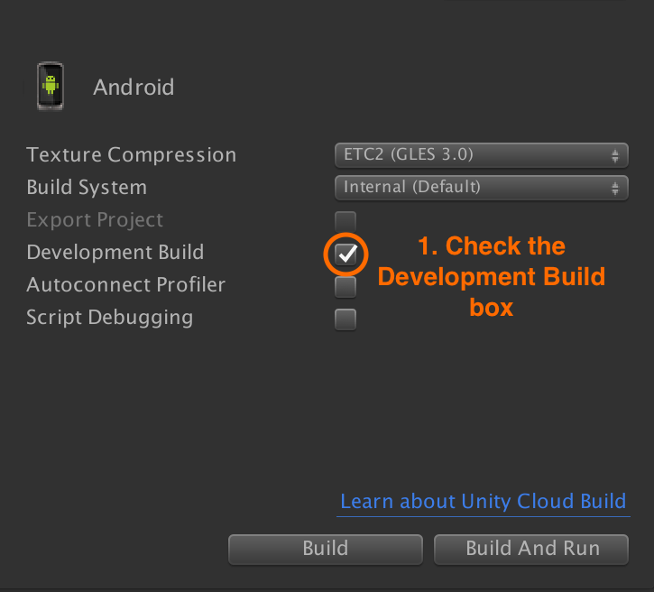

# Optimizing Pico experiences

The following instructions are optional and should normally only be followed if your VR experience is exhibiting performance issues that:

* Degrade gameplay
* Induce nausea or motion sickness in players
* Create rendering distance issues
* Introduce delays, blurring or lag

These steps can be completed even if you do not have a development kit to test on.

## Check project settings

Check your **Project Settings** match the [recommended values](/docs/pico-vr-unity-sdk-installation.md).

## Slow Frame Rate

The overall rendering requirements of a Unity VR application can be reduced by using the line `VRSettings.renderScale = x` anywhere in code, where x is the new desired render scale. It is not recommended that this value be changed very often because it can negatively impact performance whenever it's value is set, but changing a projects render scale to a value less than 1.0f will reduce the overall rendering cost of the entire application at the cost of some visual clarity.

This method works by resizing the textel to pixel ratio of the application, before stretching or shrinking the result onto the devices screens. Thus, a project using a VRSettings.renderScale of 0.5f could potentially run at twice it's usual speed but would appear to be running on a device that had half the resolution and image quality as would be expected. This method should be used sparingly, and as a trade off between frame rates and image quality when other optimization methods are not effective. A minimum VRSettings.renderScale of 0.7f is suggested.
https://docs.unity3d.com/540/Documentation/ScriptReference/VR.VRSettings-renderScale.html

## Blurry Images / Pixel-Bleeding

Pixel bleeding is a rendering issue that occurs on some devices and on some kinds of rendering, where the colors from one screen pixel appear to merge into those around it giving the impression of a blurry image. This can be solved at the expense of processing power by using `VRSettings.renderScale = x` anywhere in code, where x has a value greater than 1.0f. It is not recommended that this value be changed very often because it can negatively impact performance whenever it's value is set.

This method works by resizing the textel to pixel ratio of the application, before stretching or shrinking the result onto the devices screens. In the case of blurry images this means that effects of image blur are shrunken and reduced, meaning that a sharper image is drawn. Although the number of textels increases the overall number of physical pixels on the device will always remain the same, and so setting VRSettings.renderScale to a high value will stop providing noticeable results quite quickly but will continue to reduce performance of the app overall. This method should be used sparingly, and as a trade off to balance between frame rates and image quality when other optimization methods are not effective. A maximum VRSettings.renderScale of 1.5f is suggested.
https://docs.unity3d.com/540/Documentation/ScriptReference/VR.VRSettings-renderScale.html

## Visual issues with Shaders and Materials

Virtual Reality applications are often very demanding for mobile devices to cope with, and visual problems often occur. Even if an application performs at a decent framerate it is common for visual issues unique to the hardware to present themselves.

Shaders are a common source of visual faults, and shaders that appear to run faultlessly in the unity editor can break on device. Particularly shaders that rely on reflections, specular lighting, or other visual tricks that rely on the shader knowing the cameras position relative to a surface are often prone to failure. This is because some shaders do not cope well with the fact that Virtual reality relies on two cameras and two points of view to achieve it's desired effect. It is recommended that complicated shaders be simplified or replaced where necessary.

Often shaders or rendered objects can fail to draw correctly due to system limitations. Complicated materials rendered onto a large object can often appear to break and seem to flicker in and out of view disorentatlingly on some platforms. One proven way to help reduce this is to ensure that on problematic materials do not have 'GPU Instancing' enabled, as this Unity feature does not seem to behave stably on some platforms.

<p align="center">
  
</p>

## Foveated Rendering

Foveated Rendering is a VR optimisation that can improve the headsets ability to render scenes quickly. It's purpose is to render the screen centre to the users line of sight in high resolution, but to render the scenery in the users pheripheral vision with far less detail.

Foveation settings can be found in the **Pvr_Unity_SDK_Eye.cs** script, which is attached to the **'LeftEye'** and **'RightEye'** objects found in the **Pvr_UnitySDK** prefab.

<p align="center">
  
</p>

The variable 'Foveaton Level' can be set to define a preset level of Foveaton for each eye (It is reccomended that each eye be set to the same level), or the individual Foveaton levels can be tweaked to get more specific behaviour:

**Fovtion Gain Value:** A vector 2 to declare the Fovation rate of peripheral pixels in the X and Y axis. The larger the value, the larger the reduction. 
**Foveation Area:** The area in the centre of the users vision that will not be altered by Fovtion.
**Foveation Minimum:** The texture coordinate parameter of the texture filter function.

## Performance Profiling

Unity provides the ability to run performance profiling tools on a Pico device that can help you diagnose the root cause of any performance issues your VR experience may have.

### Enabling the internal profiler

Open the **Player Settings** using the **Edit > Project Settings > Player** menu item.

Open the **Other Settings** section and find the **Optimization** section. Check the **Enable Internal Profiler box.

<p align="center">
  
</p>

Open your **Build settings** using the **File > Build Settings**. Check the **Development Build** box.

<p align="center">
  
</p>

## Creating the development build

If you have a Pico development kit, connect the device via USB and build and run your application.

If you do not have a development kit, build the APK and [submit it to WEARVR as a test build](https://users.wearvr.com/developers/devices/pico-goblin/test-builds), adding in the testing notes that you would like the profile logs for the build. WEARVR will run it on a Pico headset for you and send you the results so you can use them to diagnose any performance problems.

## Capturing the profile logs

To view the profiling logs of the device, you will need to [enable developer mode](/docs/pico-goblin-developer-mode-usb-debugging.md) and have logcat installed your development machine.

If you have already installed the **Android SDK** or **Android Studio**, it should already be installed on your system. If not, you can get it by downloading the [Android SDK Platform Tools](https://developer.android.com/studio/releases/platform-tools.html).

You can start logcat with the following command:

```
adb logcat
```

The profiling logs will then appear in **logcat** when you run the development build of your VR experience on the Pico device. You will need to ensure the device is still connected to your development machine via USB to receive the logs.

If you do not see any logs, disconnect and reconnect the USB cable. Wait five seconds and then restart **logcat**.

When working correctly, you should see logging like the following appear at regular intervals:

```
10-20 02:44:08.122 4422-4441/? D/Unity: Android Unity internal profiler stats:
10-20 02:44:08.122 4422-4441/? D/Unity: cpu-player>    min: 16.1   max: 16.5   avg: 16.3
10-20 02:44:08.122 4422-4441/? D/Unity: cpu-ogles-drv> min:  0.0   max:  0.0   avg:  0.0
10-20 02:44:08.122 4422-4441/? D/Unity: gpu>           min:  0.0   max:  0.0   avg:  0.0
10-20 02:44:08.122 4422-4441/? D/Unity: cpu-present>   min:  0.3   max:  0.6   avg:  0.4
10-20 02:44:08.122 4422-4441/? D/Unity: frametime>     min: 16.5   max: 16.9   avg: 16.7
10-20 02:44:08.122 4422-4441/? D/Unity: batches>       min:  37    max:  37    avg:  37
10-20 02:44:08.122 4422-4441/? D/Unity: draw calls>    min:  37    max:  37    avg:  37
10-20 02:44:08.122 4422-4441/? D/Unity: tris>          min:  9546  max:  9546  avg:  9546
10-20 02:44:08.122 4422-4441/? D/Unity: verts>         min:  6780  max:  6780  avg:  6780
10-20 02:44:08.122 4422-4441/? D/Unity: dynamic batching> batched draw calls:   0 batches:   0 tris:     0 verts:     0
10-20 02:44:08.122 4422-4441/? D/Unity: static batching>  batched draw calls:   0 batches:   0 tris:     0 verts:     0
10-20 02:44:08.122 4422-4441/? D/Unity: player-detail> physx:  0.0 animation:  0.0 culling  0.0 skinning:  0.0 batching:  0.0 render:  0.0 fixed-update-count: 0 .. 0
10-20 02:44:08.122 4422-4441/? D/Unity: managed-scripts>  update:  0.0   fixedUpdate:  0.0 coroutines:  0.0
10-20 02:44:08.122 4422-4441/? D/Unity: managed-memory>   used heap: 577536 allocated heap: 688128, max number of collections: 0 collection total duration:  0.0
```

## Understanding the logs

Unity has an [excellent guide](https://docs.unity3d.com/Manual/iphone-InternalProfiler.html) that will help you interpret the performance profile logs. This should be read in conjunction with Unity’s explanation of [CPU bound and GPU bound performance issues](https://docs.unity3d.com/Manual/OptimizingGraphicsPerformance.html) to guide your approach to addressing performance problems.

## Next: Submission

It's time to [submit your VR experience](/Readme.md#uploading-and-selling-your-experiences).
