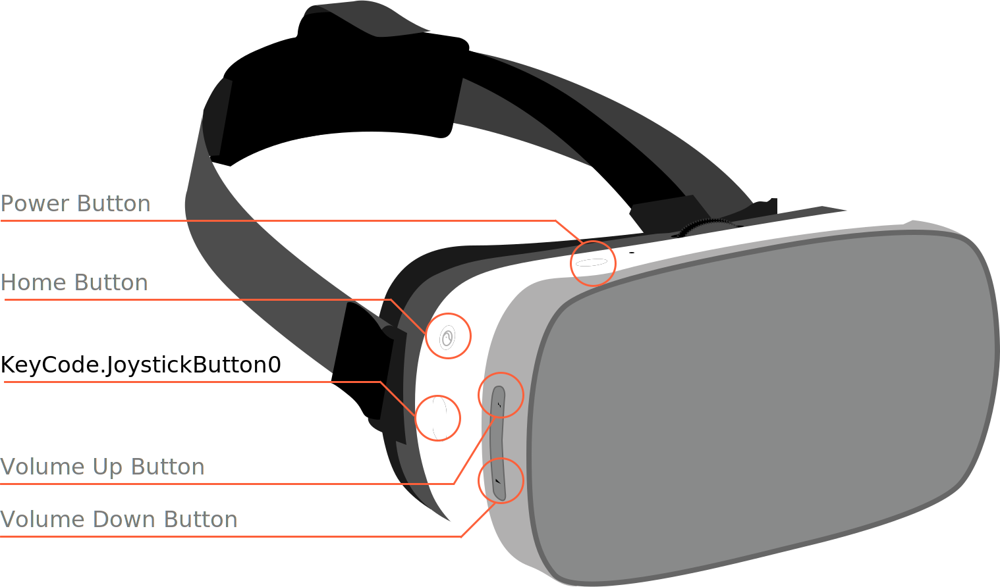
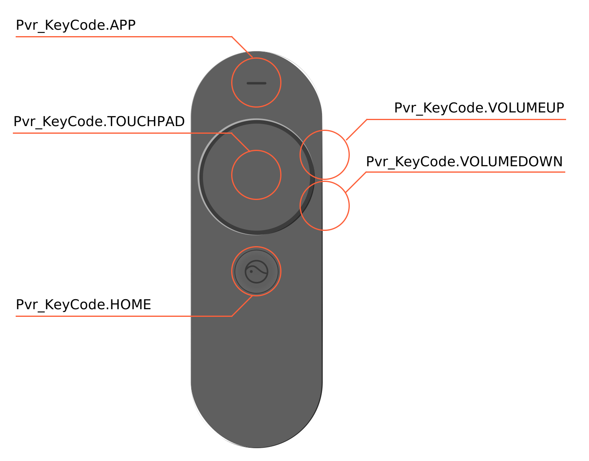
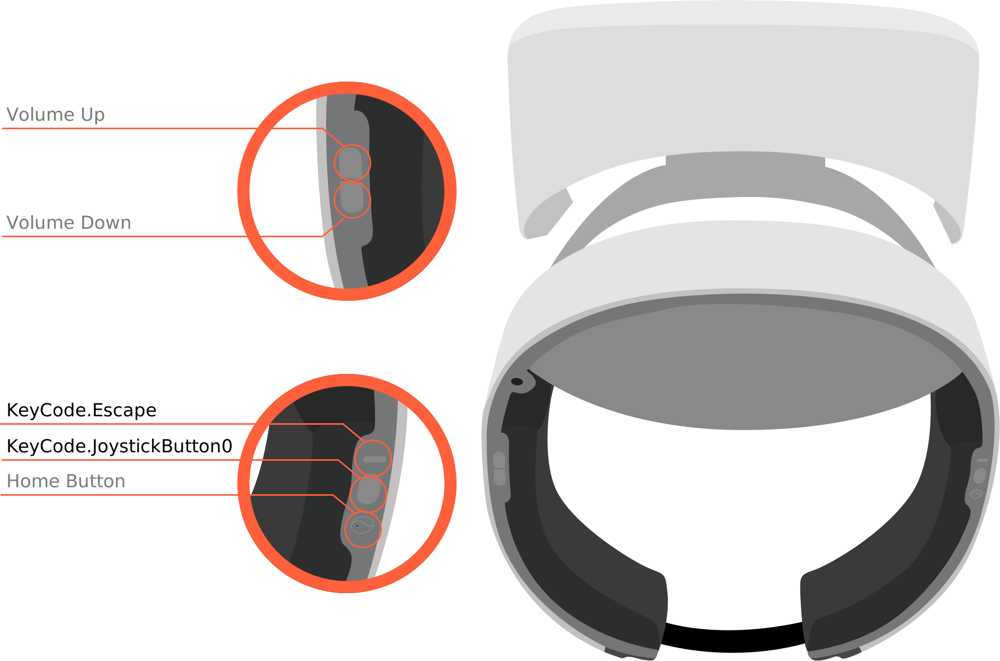
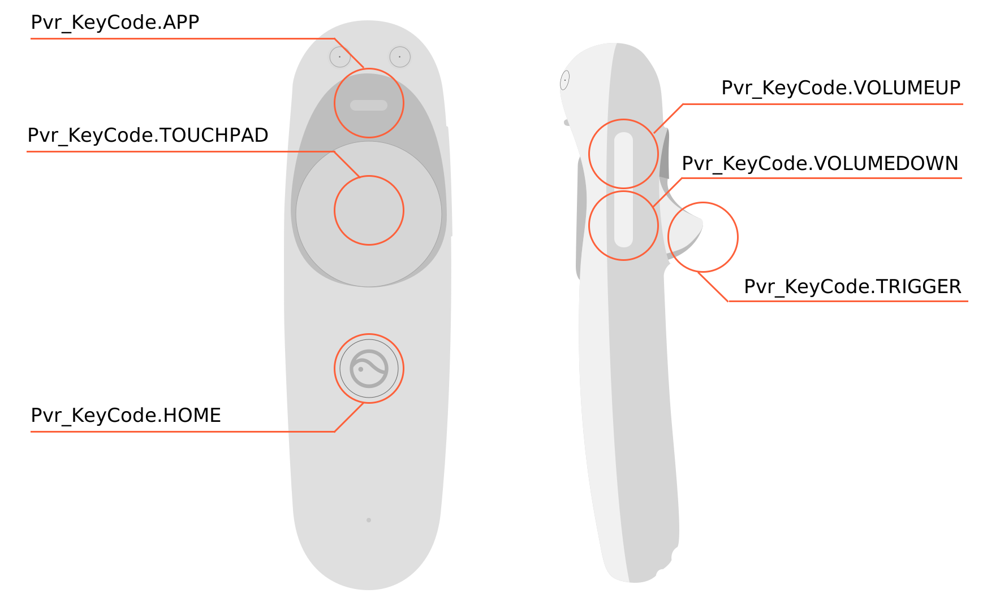
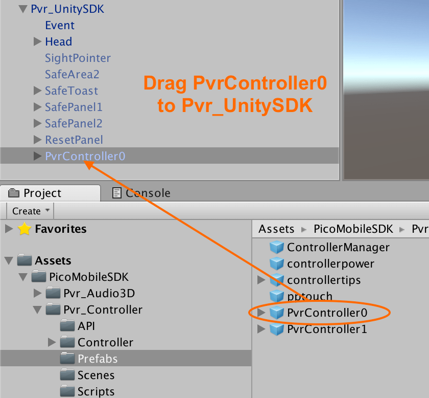
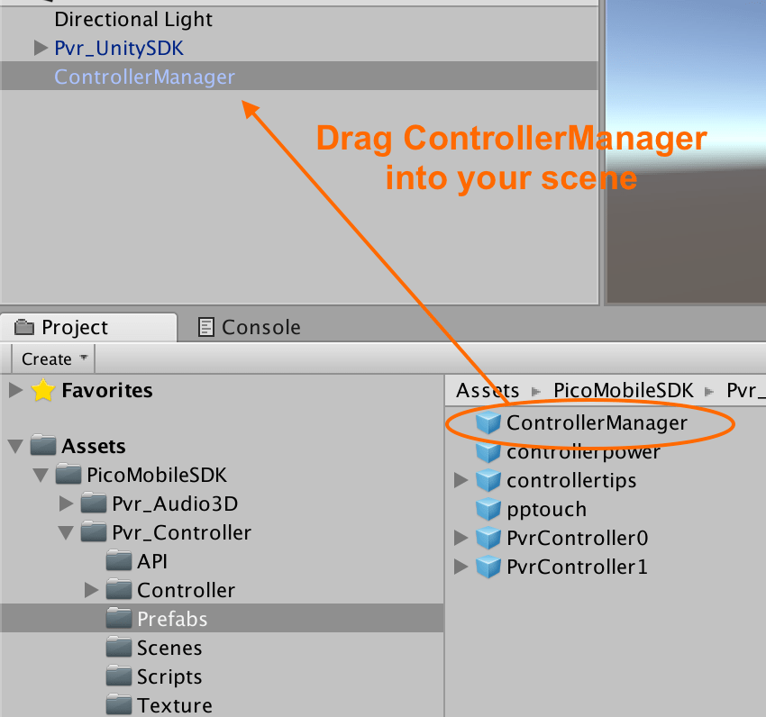
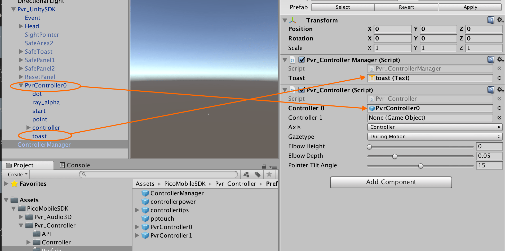
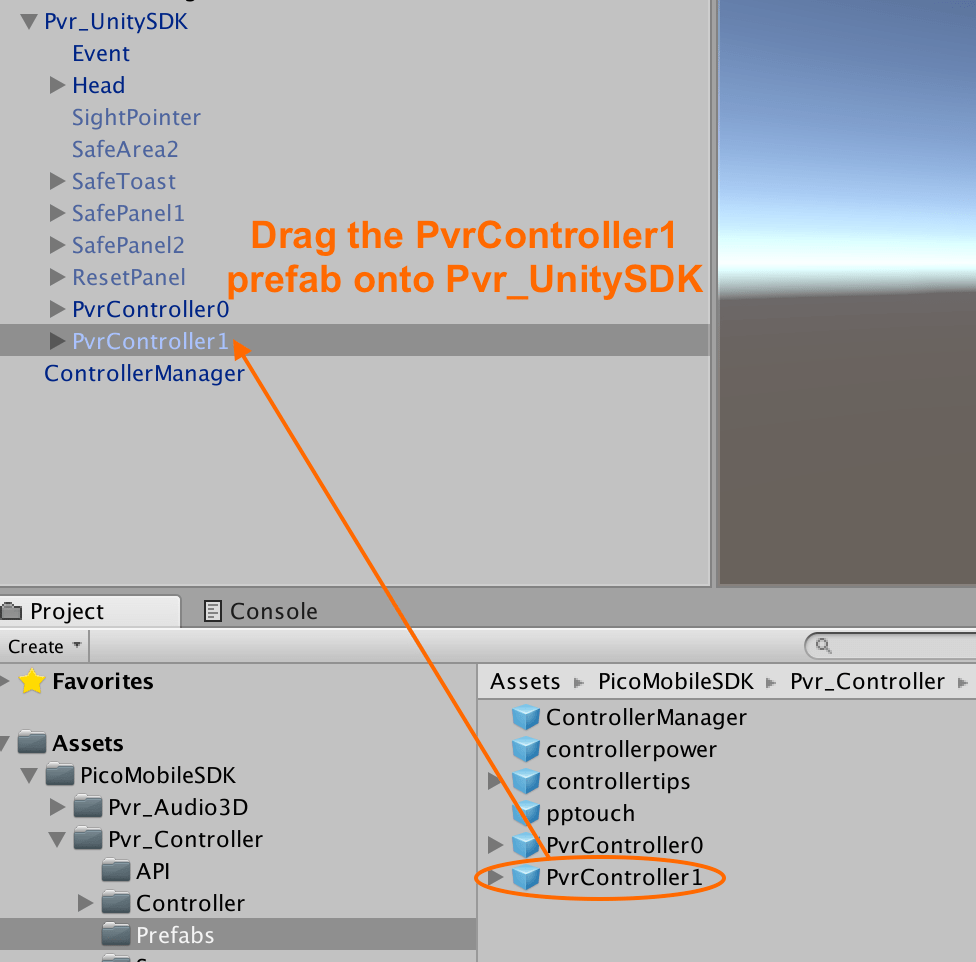
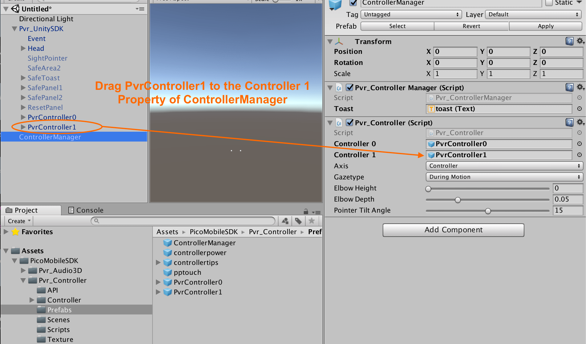
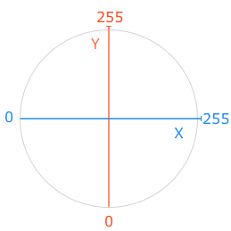

# Pico Neo and Pico Goblin headset and controller buttons

Once you have [installed the Pico VR Unity SDK](/docs/pico-vr-unity-sdk-installation.md), you can begin to bind to button events from the headset and Hummingbird controller.

## Pico Goblin & Hummingbird controller

#### Pico Goblin Headset buttons

The Pico Goblin headset is a 3 degrees of freedom headset and provides basic gaze-based pointer input and some additional buttons for operating system functionality.

<p align="center">
  
</p>

#### Hummingbird controller

Each Pico Goblin headset is sold with a Hummingbird input controller. The controller supports 3 degrees of freedom and provides more opportunities for the user to interact with virtual reality experiences.

Integrating with the Hummbingbird gamepad is an **optional** step, but is highly encouraged for experiences that can make use of additional forms of input.

<p align="center">
  
</p>

## Pico Neo & Neo Controller

The Pico Neo headset is a 6 degrees of freedom headset and provides the same basic gaze-based pointer input and buttons for operating system functionality that the Pico Goblin does.

<p align="center">
  
</p>

#### Pico Neo controller

Each Pico Neo headset is sold with a single Pico Neo controller, but it also provides support for a second if you want your VR experiences to incorporate input from both of the player's hands. Pico Neo controllers support 3 degrees of freedom.

Like the Humminegbird controller, integrating with the Neo controller(s) is an **optional** step, but is highly encouraged for experiences that can make use of additional forms of input.

<p align="center">
  
</p>

## Binding to headset button input

Pico headsets use Unity's standard `Input.GetKey` method:

```cs
public bool Input.GetKey(KeyCode key)
```

It is compatible with the following key codes:

| Button | Available on Pico Neo | Available on Pico Goblin |
|:---:|:---:|:---:|
| `KeyCode.Escape` | Yes | No|
| `KeyCode.JoystickButton0` | Yes | Yes |


#### Example

```cs
public class MyClass : MonoBehaviour {
    private void Update()
    {
        if (Input.GetKey(KeyCode.JoystickButton0))
        {
            // The "confirm" button is currently pressed on the headset
        }
    }
}
```

## Binding to controller button input

To install, drag the `Assets/PicoMobileSDK/Pvr_Controller/Prefabs/PvrController0` prefab into your scene so it appears as a child of `Pvr_UnitySDK` (at the same level as `Head`).

<p align="center">
  
</p>

Then drag the `Assets/PicoMobileSDK/Pvr_Controller/Prefabs/ControllerManager` prefab into your scene.

<p align="center">
  
</p>

Drag the `PvrController0 > Toast` from your scene to the **Toast** property of the **Pvr_Controller Manager (Script)** attached to the `ControllerManager`. Then, drag the `PvrController0` from your scene to the **Controller 0** property of the **Pvr_Controller (Script)** attached to the `ControllerManager`.

<p align="center">
  
</p>

#### Pico Neo: Enabling a second controller

The Pico Neo supports a second controller, which you can enable by dragging the `Assets/PicoMobileSDK/Pvr_Controller/Prefabs/PvrController1` prefab into your scene as a child of `Pvr_UnitySDK`:

<p align="center">
  
</p>

Then drag `Pvr_Controller1` to the **Controller 1** property on `ControllerManager`:

<p align="center">
  
</p>

#### Providing fallback headset controls

If it makes sense for your VR app, it is a good idea to provide fallback headset controls when the Hummingbird controller is not available. All Pico headsets are sold with the controller, but users will appreciate the ability to play games when their controller is unavailable.

You can define fallback controls using code similar to the following:

```cs
using Pvr_UnitySDKAPI;

public class MyClass : MonoBehaviour {

    private void Update()
    {
        if (Pvr_UnitySDKAPI.Controller.UPvr_GetControllerState(0) == Pvr_UnitySDKAPI.ControllerState.Connected)
        {
            // Control system when controller is connected
        } else {
            // Control system when controller is not connected
        }
    }
}
```

## Pico controller Unity API

### Controller indexes

Unless you are using creating a Pico Neo experience and want to access the second controller, the `controllerIndex` parameter should always be `0` when calling any of the following API methods.

If you do want to access the second controller, use a value of `1` instead.

### Buttons

#### UPvr_GetKeyDown

Whether the current frame is the first in which key is pressed down.

```cs
public bool UPvr_GetKeyDown (int controllerIndex, Pvr_KeyCode key)
```

##### Parameters & Return value

| Name | Value |
|:---|:---|
| `controllerIndex` | The [index of the controller](#controller-indexes) you want to query |
| `key` | enum `Pvr_KeyCode {TOUCHPAD, HOME, APP, VOLUMEUP, VOLUMMEDOWN }` |
| Return value | `true` for the first frame in which `key` has been pressed down, else `false` |

#### UPvr_GetKeyUp

Whether the current frame is the first one after key has been released.

```cs
public bool UPvr_GetKeyUp (int controllerIndex, Pvr_KeyCode key)
```

##### Parameters & Return value

| Name | Value |
|:---|:---|
| `controllerIndex` | The [index of the controller](#controller-indexes) you want to query |
| `key` | enum `Pvr_KeyCode {TOUCHPAD, HOME, APP, VOLUMEUP, VOLUMMEDOWN }` |
| Return value | `true` for the first frame after `key` has been released, else `false` |

##### Example

```cs
using Pvr_UnitySDKAPI;

public class MyClass : MonoBehaviour {

    private void Update()
    {
        if (Controller.UPvr_GetKeyUp(0, Pvr_KeyCode.TOUCHPAD))
        {
            // Touchpad was just released
        }
    }
}
```

#### UPvr_GetKey

Whether a key is pressed down during the current frame.


```cs
public bool UPvr_GetKey (int controllerIndex, Pvr_KeyCode key)
```

##### Parameters & Return value

| Name | Value |
|:---|:---|
| `controllerIndex` | The [index of the controller](#controller-indexes) you want to query |
| `key` | enum `Pvr_KeyCode {TOUCHPAD, HOME, APP, VOLUMEUP, VOLUMMEDOWN }` |
| Return value | `true` if `key` is currently pressed, else `false` |

##### Example

```cs
using Pvr_UnitySDKAPI;

public class MyClass : MonoBehaviour {

    private void Update()
    {
        if (Controller.UPvr_GetKey(Pvr_KeyCode.TOUCHPAD))
        {
            // Touchpad is currently pressed
        }
    }
}
```

#### UPvr_GetKeyLongPressed

Whether a long press has occurred for key.


```cs
public bool UPvr_GetKeyLongPressed (int controllerIndex, Pvr_KeyCode key)
```

##### Parameters & Return value

| Name | Value |
|:---|:---|
| `controllerIndex` | The [index of the controller](#controller-indexes) you want to query |
| `key` | enum `Pvr_KeyCode {TOUCHPAD, HOME, APP, VOLUMEUP, VOLUMMEDOWN }` |
| Return value | `true` if `key` is has been pressed for more than 20 frames, else `false` |

##### Example

```cs
using Pvr_UnitySDKAPI;

public class MyClass : MonoBehaviour {

    private void Update()
    {
        if (Controller.UPvr_GetKeyLongPressed(0, Pvr_KeyCode.TOUCHPAD))
        {
            // Touchpad has been pressed for at least 20 frames
        }
    }
}
```

### Touchpad

#### UPvr_IsTouching

Whether the touch pad is being touched (but not necessarily pressed).

```cs
public bool UPvr_IsTouching (int controllerIndex)
```

##### Parameters & Return value

| Name | Value |
|:---|:---|
| `controllerIndex` | The [index of the controller](#controller-indexes) you want to query |
| Return value | `true` if the touchpad is being touched in the current frame. |

##### Example

```cs
using Pvr_UnitySDKAPI;

public class MyClass : MonoBehaviour {

    private void Update()
    {
        if (Controller.UPvr_IsTouching(0))
        {
            // Touchpad is currently being touched (but not necessarily pressed)
        }
    }
}
```

#### UPvr_GetSwipeDirection

Whether a slide gesture was detected in a particular direction since the last frame.


```cs
public static SwipeDirection UPvr_GetSwipeDirection (int controllerIndex)
```

##### Parameters & Return value

| Name | Value |
|:---|:---|
| `controllerIndex` | The [index of the controller](#controller-indexes) you want to query |
| Return value | enum `SwipeDirection {No, SwipeUp, SwipeDown, SwipeRight, SwipeLeft}` |


##### Example

```cs
using Pvr_UnitySDKAPI;

public class MyClass : MonoBehaviour {

    private void Update()
    {
        SwipeDirection swipeDirection = Controller.UPvr_GetSwipeDirection(0);

        if (swipeDirection == SwipeDirection.SwipeDown)
        {
            // Touchpad received swipe down gesture since the last frame
        }
    }
}
```

#### UPvr_GetTouchPadPosition

Get the coordinate of the point on the touchpad that is currently being touched.

The y axis is from the bottom of the controller to the top, starting at 0.0 at the bottom-most point and going to 255 at the top-most point.

The x axis is from the left of the controller to the right, starting at 0.0 at the left-most point and going to 255 at the right-most point.

When the touchpad is not being touched at all, both axis values are 0.0.

<p align="center">
  
</p>


```cs
public Vector2 UPvr_GetTouchPadPosition (int controllerIndex)
```

##### Parameters & Return value

| Name | Value |
|:---|:---|
| `controllerIndex` | The [index of the controller](#controller-indexes) you want to query |
| Return value | Vector2: Point on the x or y axis a touch is occurring |

##### Example

```cs
using Pvr_UnitySDKAPI;

public class MyClass : MonoBehaviour {

    private void Update()
    {
	    Vector2 touchPosition = Controller.UPvr_GetTouchPadPosition(0);

	    float yCoordinate = touchPosition.y;
	    float xCoordinate = touchPosition.x;
    }
}
```

### Controller orientation

#### UPvr_GetControllerQUA

Get the rotation quaternion of the Hummingbird Controller.

```cs
public Quaternion UPvr_GetControllerQUA (int controllerIndex)
```

##### Parameters & Return value

| Name | Value |
|:---|:---|
| `controllerIndex` | The [index of the controller](#controller-indexes) you want to query |
| Return value | Hummingbird controller rotation quaternion |

### Next: Enabling developer mode

See [Enabling USB debugging](/docs/pico-goblin-developer-mode-usb-debugging.md)
