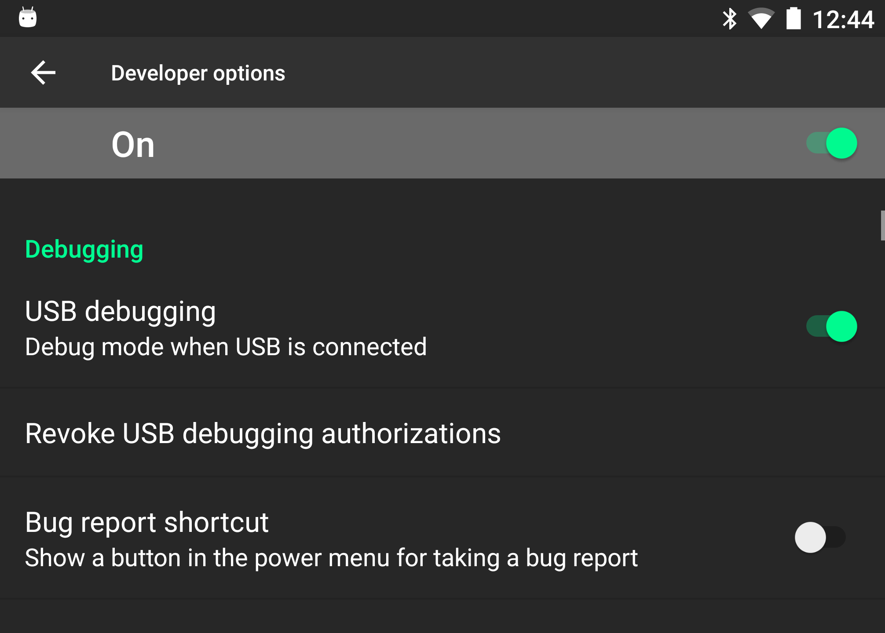

# Pico Goblin developer mode & USB debugging

In order to build your Pico VR experience to the device, developer mode and USB debugging must first be enabled.

## Accessing the settings menu

### Pico Neo

To access the settings menu for the pico Neo, select the **Settings** option from the main menu.

  

### Pico Goblin, Goblin 2, Goblin 2 4K

To access the settings menu on Goblin devices press "Confirm" and "Volume Down" button together to go into 2D Setting menu. 

## Enabling developer mode

From the settings menu select the About option. Click eight times on the **PUI Version** with the controller.

  

Select the **Developer** or **Advanced Options** now present in the menu.

  

Scroll down and select **About device**

  

Press on the **PUI Version** 10 times.

  

Return to the previous menu and select the **Developer options** that is now visible.

  

Turn on the **Developer options** and **USB debugging** toggles.

  

To allow your computer to access the Goblins files you will also need to select USB configuration, and reset it to 'MTP (Media Transfer Protocol)'. 

## Next: Building to the Pico Goblin

See [building to the Pico Goblin](/docs/building-to-pico-goblin.md).
