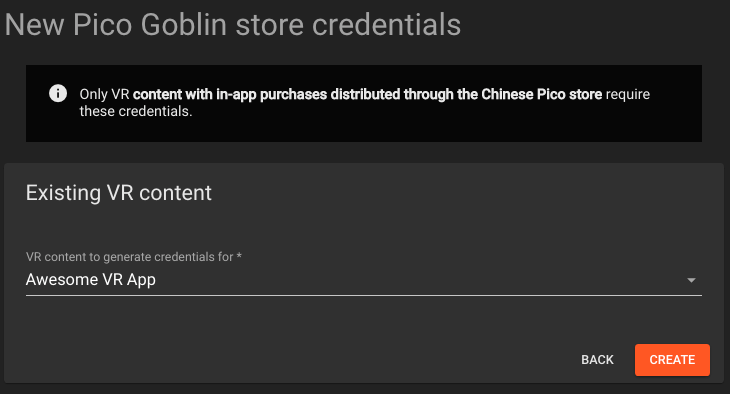
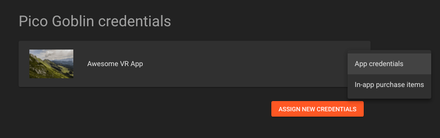
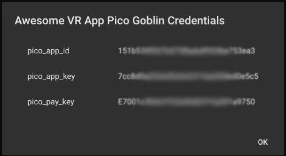
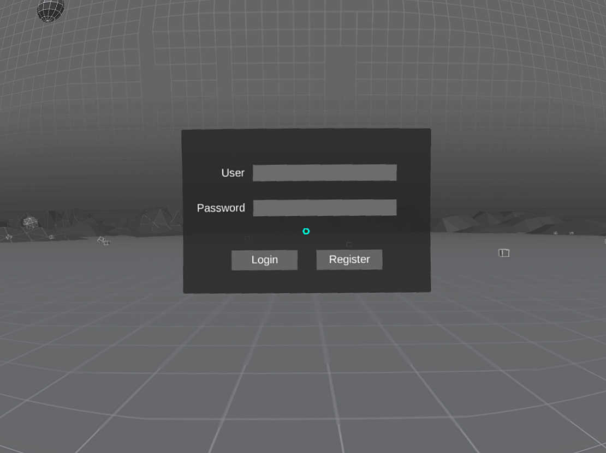

# Pico Payment & User Management

The Pico SDK provides the ability to integrate with Pico’s payment and user management infrastructure.

This is an optional step that is only required if your app has in-app purchases or needs user information to function.

> It's strongly recommended that you [upgrade to the latest version of the Pico Goblin firmware and operating system](/docs/upgrading-pico-goblin-operating-system-firmware.md) before attempting these steps.

## Update AndroidManifest.xml

Edit the `Plugins/Android/AndroidManifest.xml` file:

##### Permissions

Check the following lines are present:

```
<!-- Access to the device's network interface -->
<uses-permission android:name="android.permission.INTERNET"/>
<uses-permission android:name="android.permission.ACCESS_WIFI_STATE"/>
<uses-permission android:name="android.permission.ACCESS_NETWORK_STATE"/>

<!-- Access to configuration files on the device -->
<uses-permission android:name="android.permission.WRITE_EXTERNAL_STORAGE"/>
```

##### Credentials

If you have not already done so, you will need to log in to the WEARVR developer dashboard and [request credentials for your app](https://users.wearvr.com/developers/devices/pico-goblin/store-listings/).

<p align="center">
  
</p>

View your new app credentials via the context menu:

<p align="center">
  
</p>

And a dialog with your app's Pico credentials will appear:

<p align="center">
  
</p>

Replace the following lines:

```
<meta-data android:name="pico_merchant_id" android:value="81" />
<meta-data android:name="pico_app_id" android:value="5a189befeb3b33f7df101fbecffe4f98" />
<meta-data android:name="pico_app_key" android:value="25ba00fb73343ff1ec32e1c152fff291" />
<meta-data android:name="pico_pay_key" android:value="d828c5d3a1cc11e6b7fe008cfaf3d930" />
<meta-data android:name="pico_redirectUrl" android:value="http://www.picovr.com" />
<!--Scope of authorization-->
<meta-data android:name="pico_scope" android:value="get_user_info" />
```

With one of the following (substituting the `REPLACE_ME` values with the corresponding credentials from the WEARVR developer dashboard):

###### Domestic values (inside China)

For a build to be *released in China*:

```
<!-- Your app's credentials used for user sessions & payments within China -->
<meta-data android:name="pico_merchant_id" android:value="1335"/>
<meta-data android:name="pico_app_id" android:value="REPLACE_ME"/>
<meta-data android:name="pico_app_key" android:value="REPLACE_ME"/>
<meta-data android:name="pico_pay_key" android:value="REPLACE_ME"/>
<meta-data android:name="pico_scope" android:value="SCOPE"/>
```

###### Foreign values (outside China)

Or, for a build to be *released outside of China*:

```
<!-- Your app's credentials used for user sessions & payments of China  -->
<meta-data android:name="pico_merchant_id_foreign" android:value="1335"/>
<meta-data android:name="pico_app_id_foreign" android:value="REPLACE_ME"/>
<meta-data android:name="pico_app_key_foreign" android:value="REPLACE_ME"/>
<meta-data android:name="pico_pay_key_foreign" android:value="REPLACE_ME"/>
<meta-data android:name="pico_scope_foreign" android:value="SCOPE"/>
```

## Managing user sessions

### Logging the user in

The following method redirects the user to the Pico operating system and displays a login dialog if the user has not already signed in to their headset. Once the user has signed in, they are redirected back to your app and a callback is invoked (see below).

<p align="center">
  
</p>

If the user is already signed in, it immediately invokes the user information callback.

```cs
void PicoPaymentSDK.Login();
```

Example:

```cs
#if !UNITY_EDITOR
PicoPaymentSDK.Login();
#endif
```

To receive the result of the login, define a GameObject in your scene called `PicoPayment` and attach a `MonoBehaviour` script that defines a `LoginCallback` method.

> The Pico SDK expects a GameObject called `PicoPayment` to receive callback information from the underlying operating system. This is currently hard-coded, so must match exactly or your callbacks will not be triggered.

```
void LoginCallback(string result);
```

Where `result` is a string containing a serialized JSON object representing the result of the sign in request.

#### Response attributes

The JSON response object has the following attributes:

* `"isSuccess"` -  `"true"` when the request has succeed, otherwise `"false"`
* `"msg"` - For successful requests, it is `"SUCCESS"`. For failed requests, it is a localized description of why the request failed.


Example:

```
{
    "isSuccess":"true",
    "msg":"SUCCESS"
}
```

#### Logging in error handling

The following responses should be handled by your app:

| msg | Description |
| :---: | :--- |
| `"Network Exception,please check the network connection"` | The device is not currently connected to the internet. Display a dialog to the user with the following message, asking the user to check their connection and try again: 网络链接错误，请检查网络稍后再试。 |


#### Example implementation

```cs
using LitJson;

public class Callback : MonoBehaviour{
    public void LoginCallback(string result) {
        JsonData response = JsonMapper.ToObject(result);

        if (response["isSuccess"] == "true" ) {
            PicoPaymentSDK.GetUserAPI();
        } else {
            if response["msg"] == "Network Exception,please check the network connection" {
                // Display dialog with message ("Connection error, please check your connection and try again."):
                // 网络链接错误，请检查网络稍后再试。
            } else {
                // Another error has occurred - typically handled by the operating system.
                // Display a dialog with message ("An unknown error has occurred. Please try again later."):
                // 未知错误，请稍后再试。
            }
        }
    }
}
```

#### Logging in troubleshooting

The following error conditions should not normally occur. If they do, they may indicate that the SDK has not been correctly integrated into your project.

| msg | Description |
| :---: | :--- |
| `"Login exception ，missing parameters <appId> <appKey> <scope>"` | The SDK could not read the correct values from the `AndroidManifest.xml` file. Check you have followed the [Credentials instructions](#credentials) correctly. |
| `"ErrorMsg: APP_CHECK_ERROR"` | The `app_id` in your AndroidManifest.xml did not match any registered with the Pico services. Check that you have [entered them correctly](#update-androidmanifestxml). If so, the most likely casue of this is you have not yet [changed the device's locale](/docs/testing-in-app-purchases.md). This can also occur when you need to update the [Pico OS version](/docs/upgrading-pico-goblin-operating-system-firmware.md). |
| `"ErrorMsg: SYSTEM_SIGNAGURE_ERROR"` | The `pico_app_key` in your AndroidManifest.xml did not match any registered with the Pico services. The most likely casue of this is you have not yet [changed the device's locale](/docs/testing-in-app-purchases.md) | 

### Getting the current user session

Once the user has logged in, you can retrieve the session details at any time using PicoPaymentSDK.GetUserAPI().

```cs
void PicoPaymentSDK.GetUserAPI ();
```

To receive the result of the request for the current user’s details, define a `UserInfoCallback` method on the `PicoPayment` GameObject script you added earlier.

```cs
void UserInfoCallback(string result);
```

Where `result` is a string containing a serialized JSON object representing the result of the request for the current user’s details.

The JSON object has the following attributes:

* `"ret_code"` - A code indicating the status of the request. See Current User Request Statuses below for all available codes.
* `"ret_msg"` - A description of the response status. Use `"ret_code"` to check the status of the request rather than this attribute.
* `"data"` - An object with the current user’s details. This attribute is only present when the request succeeds. See User Attributes below for further details.
* `"exception"` - Present when a client-side exception occurs and provides a description of the error.

#### Example implementation

```cs
using LitJson;

public class Callback : MonoBehaviour{
    public void UserInfoCallback(string result) {
        JsonData response = JsonMapper.ToObject(result);

        if (response["ret_code"] == "0000" ) {
            // Current user request successful

            JsonData user = response["data"];
        } else if (response["exception"] == "user is not login") {
            PicoPaymentSDK.Login();
        } else {
            // Display a dialog with message ("An unknown error has occurred.
            // Please try again later."):
            // 未知错误，请稍后再试。
        }
    }
}
```

#### Successful user details request

| Response (after being parsed as JSON) | Description |
| :---: | :--- |
| `{ "ret_code": "0000", "data": { ... } }` | The request for the current user’s details has succeeded. You can now store and refer to the user attributes in `"data"`. |

#### User attributes

Aside from `"email"`, `"openid"` and `"phone"` (users are required to have an email *or* a phone number), all fields are optional and will not appear in the JSON object at all if their value is not defined. 

| results\["data"\]\[*\] | Type | Description |
| :--- | :--- | :--- |
| `"openid"` | String | Alphanumeric id that is unique to the user and the app. i.e. This value will be the same whenever the same user opens the same app, on any Pico device. |
| `"username"` | String | User’s account name |
| `"email"` | String | User’s email address |
| `"avatar"` | String | URL to the user’s (.jpg or .png) avatar image |
| `"gender"` | String | User’s gender: `"male"` or `"female"` |
| `"birthday"` | Integer or String | Number of milliseconds between Epoch and 12:00 AM on the user’s date of birth, or an empty string if not set |
| `"firstname"` | String | User’s first name |
| `"lastname"` | String | User’s last name |
| `"aboutme"` | String | User’s About Me bio information |
| `"phone"` | String | User’s phone number |
| `"country"` | String | User’s country name ("China" for all users of the Chinese store) |
| `"city"` | String | User’s city name |

#### Maintaining a persistent user identity

You should use `"openid"` if you need a consistent id for the current user, as any other value can be changed across a user account's lifetime (including email and phone). 

`openid` is an alphanumeric string that is unique to the user and the app. i.e. This value will be the same whenever the same user opens the same app, on any Pico device. 

Unfortunately, `openid` will *not* be the same across different apps (apps with a different id) - so if the same user opens two of the same developer's apps, their `openid` will *not* be the same in both of them. If you need the user's identity to persist across apps, you will need to have them create a new account on your own game servers and create a separate identity for them that can persist across your apps.

#### User details error handling

The following responses should be handled by your app:

| Response (after being parsed as JSON) | Description | Suggested app behaviour |
| :---: | :--- | :--- |
| `"exception": "user is not login"` | The user is not logged in. | Call `PicoPaymentSDK.Login()` to display the login workflow and try again. |
| `"exception": "..."` | An exception has occurred somewhere in creating, sending or receive the request for the user details. | Retry the request before explaining there was an error retrieving their user details and to try again later. Return them to a suitable place in your app in the meantime. |

#### User details troubleshooting

The following error conditions should not normally occur. If they do, they may indicate that the SDK has not been correctly integrated into your project.

| Response (after being parsed as JSON) | Description | Suggested app behaviour |
| :---: | :--- | :--- |
| `"ret_code": "00070001"` | The App credentials failed validation. | Check the `pico_app_id` in your AndroidManifest. |
| `"ret_code": "00071001"` | Invalid app secret key. | Check the `pico_app_key` in your AndroidManifest. |
| `"ret_code": "00110001"` | Invalid Scope.	 | Check the `pico_scope` in your AndroidManifest. |

## Next: In-app purchases

See [adding in-app purchases](/docs/pico-payment-sdk-in-app-purchases.md).
