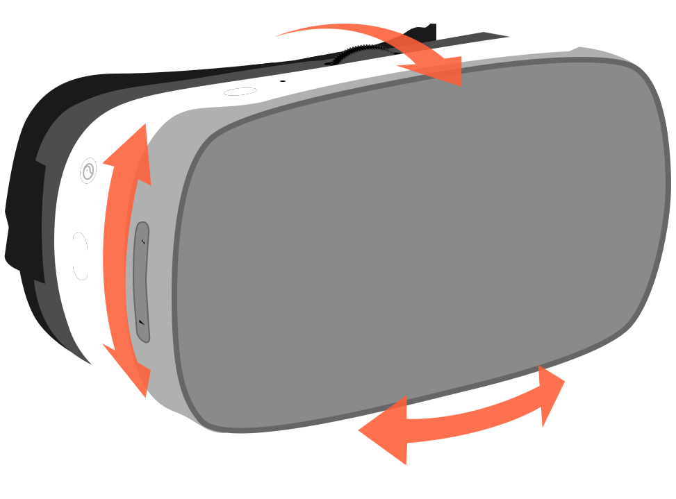
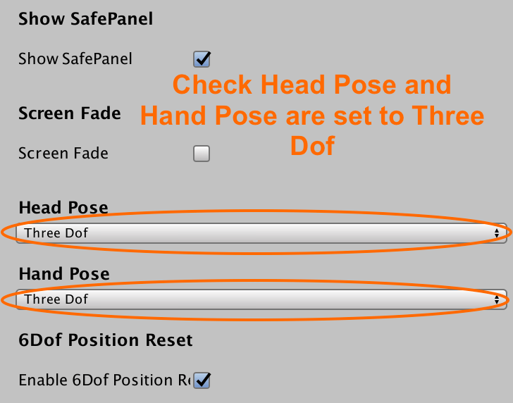
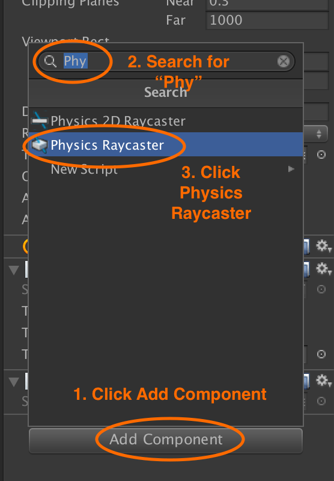
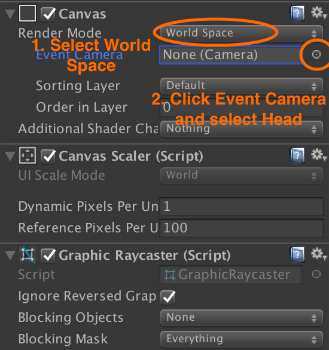
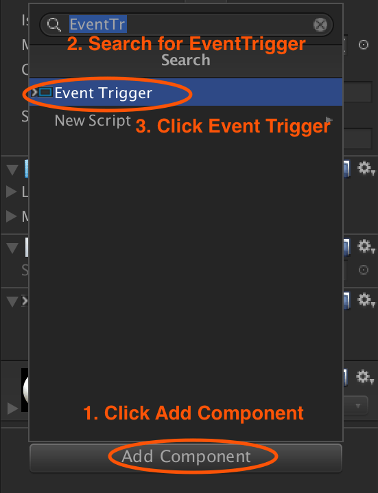
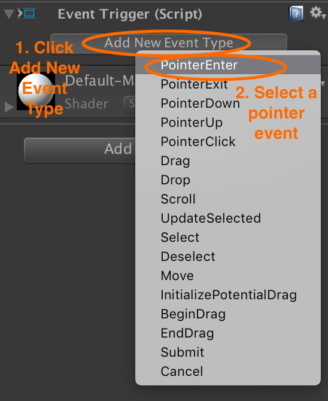
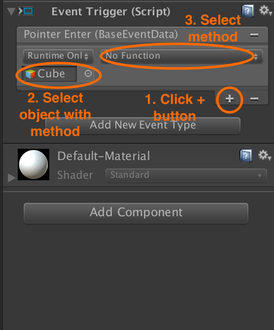

# Pico VR Unity SDK camera setup

## Selecting correct degrees of freedom

### Pico Goblin: 3 degrees of freedom

<p align="center">
  
</p>

Once you have [dragged the `Pvr_UnitySDK` prefab into your scene](/docs/pico-vr-unity-sdk-installation.md), open it in the Inspector.

If you want a build that works on both the Pico Goblin and the Pico Neo, ensure **Head Pose** is set to **Three Dof**.

Both headsets ship with a 3 DoF controller, so leave the **Hand Pose** set to **Three Dof**, regardless.

<p align="center">
  
</p>

### Pico Neo: 6 degrees of freedom

<p align="center">
  
</p>

If you wish to develop a build that only works on the Pico Neo *and* takes advantage of all 6 degrees of freedom, then you can set the **Head Pose** to **Six Dof** and check **Enable 6Dof Position Reset**, to allow re-centering the view using the Pico Home button works correctly.

The Pico Neo, when enabled for six degrees of freedom supports displaying a warning boundary. By checking **Show SafePanel**, the headset will display a warning overlay if the headset moves too far from its starting position during the course of playing your experience.

The **Use Default Range** option indicates that your app should use the default safety range of 0.8 meters from the starting position before displaying the warning boundary.

The **Moving Ratios** sets how movement in the real world corresponds to movement within your app. The default setting is 1:1.

## Set up Pvr_UnitySDKManager

Many core settings of the Pico SDK as a whole can be changed inside the  Pvr_UnitySDK prefab and it's attached `Pvr_UnitySDKManager.cs` component. 

In the section above it has already be reccomended that the HeadPose and HandPose settings be changed to match the apps target platform, however many other settings are worth considering here.

<p align="center">
  
</p>

Head Recenter: When Head Pose is Six Dof, you can only reset position by checking “Six Dof Head Recenter”, otherwise, long press Home key can only reset controller poses. 

- Show SafePanel: When Show SafePanel is checked, safe panel will be shown when the game starts. 

- Head Pose: 
  1. Three Dof, indicates that head tracking is 3 DOF, tracking only poses, not position;  
  2. Six Dof, indicates that head tracking is 6 DOF, tracking both poses and position. 
  
- Hand Pose: 
  1. Three Dof, indicates that hand tracking is 3 DOF. It tracks poses, but the position is computed based on the head pose and the data of controller sensor. The tracking scope is limited.  
  2. Six Dof, the hand tracking is 6 DOF. Both poses and positions are tracked. 

- Use Default Range: The radius of the safe area, the default is 0.8 meters. There will be area prompts and visual darkening effects beyond safe range.   

- Moving Ratios：The ratio of movement, which is the ratio of moving distance in reality and moving in the scene, by default is 1 to 1.

If you want to customize the radius of the safe region, you first need to change the private bool defaultRange=true in the pvr_unitysdkmanager.cs file to false, and then the Use Default Range will be checked. Once this has been done you will freely set the range of safe areas in the scene inspector. 

## Running in the Unity editor

The Pico VR SDK supports running your VR app in the Unity editor. You can use this to test your progress as you complete the remaining instructions.

While running in the editor, the following controls are available to you to simulate head movement:

* Holding **alt + moving the mouse** simulates the user turning their head
* Holding **ctrl + moving the mouse** simulates the user tilting their head
* Holding **alt + left clicking the mouse** allows selecting between VR Mode and Mono mode

There is currently no way to simulate button presses from the Hummingbird controller in the Unity editor.

## Raycaster setup

### PhysicsRaycaster

Add a `PhysicsRaycaster` component to the `Head` camera.

<p align="center">
  
</p>

## Setting up Canvases

All `Canvas`es must be rendered in **World Space** to work with the Pico SDK and have the **Event Camera** set to `Head` inside the `Pvr_UnitySDK` prefab you added to your scene.

<p align="center">
  
</p>

## Selecting an input module

The Pico SDK provides a two build-in input modules that you can chose to use, or opt to use your own.

### Using input modules that come with the SDK

The two input modules included in the Pico SDK are:

* `Pvr_UnitySDKSightInputModule`: Requires the user to look at an object or UGUI element and press the **Menu** button to trigger a click action. This is the default input module used in the `Pvr_UnitySDK` prefab and to use it, you do not need to make any changes.
* `Pvr_GazeInputModule`: Displays a time-based cursor that “completes” when a user gazes at a GameObject or UGUI element for long enough to automatically trigger a click action. To use this input module, remove all other input modules from `Pvr_UnitySDK/Event` in your scene and add `Pvr_UnitySDK/System/Event/Pvr_GazeInputModule`. Drag `Pvr_UnitySDK/System/Event/Pvr_GazeInputModuleCrosshair` into the **Crosshair** field.

Both input modules work by raycasting on all raycastable layers from the centre of the user's point of view, and interacting with any components that implement `IEventSystemHandler`.

> These input modules will *not* work on objects that are on layers that ignore raycasting.

### Using your own input module

The following example code may be a good starting point if you want to use your own input module instead of one that come with the Pico SDK:

```cs
using Pvr_UnitySDKAPI;
using UnityEngine;
public class WEARVRInputRaycaster : MonoBehaviour
{
    [SerializeField]
    private Transform headsetPosition; //Assign to 'Pvr_UnitySDK/Head' in inspector.
    [SerializeField]
    private Transform controller0Position; //Assign to 'Pvr_UnitySDK/PvrController0' in inspector.
    [SerializeField]
    private Transform controller1Position; //Assign to 'Pvr_UnitySDK/PvrController1' in inspector.
    private Ray ray = new Ray();
    private void Update()
    {
        if (RaycastFromHeadInput())
        {
            PerformRaycast(headsetPosition);
        }
        else if (RaycastFromHandInput(0))
        {
            PerformRaycast(controller0Position);
        }
        else if (RaycastFromHandInput(1))
        {
            PerformRaycast(controller1Position);
        }
    }
    private void PerformRaycast(Transform rayStart)
    {
        ray.direction = rayStart.forward;
        ray.origin = rayStart.position;
        RaycastHit[] hits;
        hits = Physics.RaycastAll(ray); //This can be given a maximum range, if needed.
        foreach(var hit in hits)
        {
            //Activation code should go here. Searching for button or event components, and then actioning them, is common.
        }
    }
    private bool RaycastFromHeadInput()
    {
        return Input.GetKey(KeyCode.JoystickButton0);
    }
    private bool RaycastFromHandInput(int handIndex)
    {
        if (Pvr_UnitySDKAPI.Controller.UPvr_GetControllerState(handIndex) != Pvr_UnitySDKAPI.ControllerState.Connected) return false;
        return Controller.UPvr_GetKey(handIndex, Pvr_KeyCode.TOUCHPAD);
    }
}
```

## Pointer input

The Pico VR SDK adapts the motion of the headset or Hummingbird controller to Unity’s `Pointer*` events. This means you can attach handlers for these events in one of the usual ways:

* Attach an `EventTrigger` with one or more `Pointer*` events
* Attach a script that implements one or more of the [Unity pointer handler interfaces](https://docs.unity3d.com/ScriptReference/EventSystems.IPointerClickHandler.html).

### Using an EventTrigger

Using an `EventTrigger` on your UI component or `GameObject` is the simplest way of responding to gaze-based events and show normally be the preferred method.

Add an `EventTrigger` to your UI component or GameObject.

<p align="center">
  
</p>

Add an event type and select the pointer, drag or scroll event you want to trigger a method.

<p align="center">
  
</p>

If you want to call a method on a script on the current object, add it by dragging it onto your UI component or `GameObject` or by using the **Add Component** button.

Select the object and method you want to call when the event is triggered.

<p align="center">
  
</p>

### Using a pointer handler interface

For greater flexibility, you can use a script that implements one or more of the [Unity pointer handler interfaces](https://docs.unity3d.com/ScriptReference/EventSystems.IPointerClickHandler.html) and attach it to your UI component or GameObject.

For example, a script that responds to when the center button is pressed on the headset has the following structure:

```cs
public class CanvasComponent : MonoBehaviour, IPointerClickHandler
  {
      void OnPointerClick(PointerEventData eventData)
      {

      }
  }
```

Either drag your script onto your UI component or GameObject to add it as a component, or use the **Add Component** button and search for it.

### Next: Binding to buttons

See [Pico headset and controller buttons](/docs/pico-goblin-and-neo-controllers.md).
