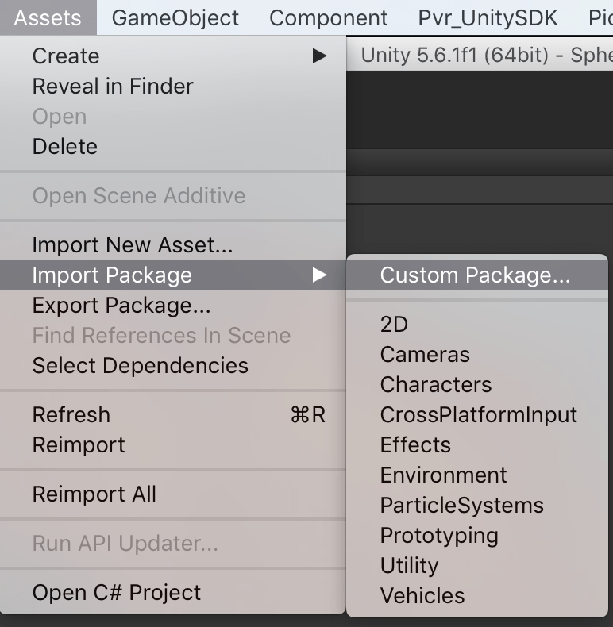
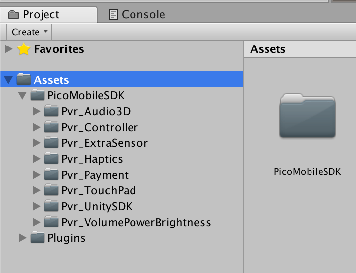
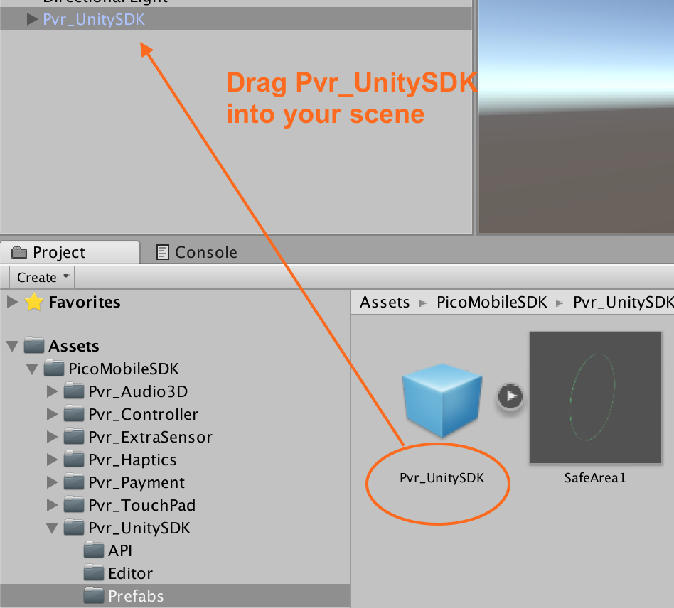
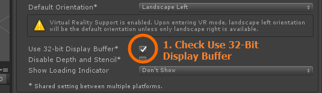
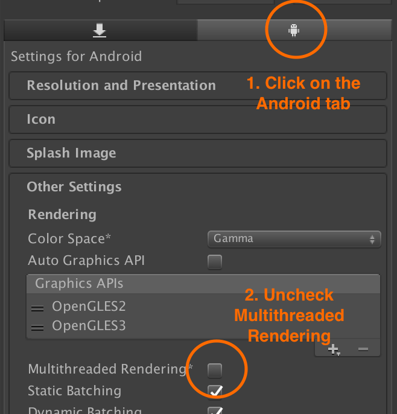
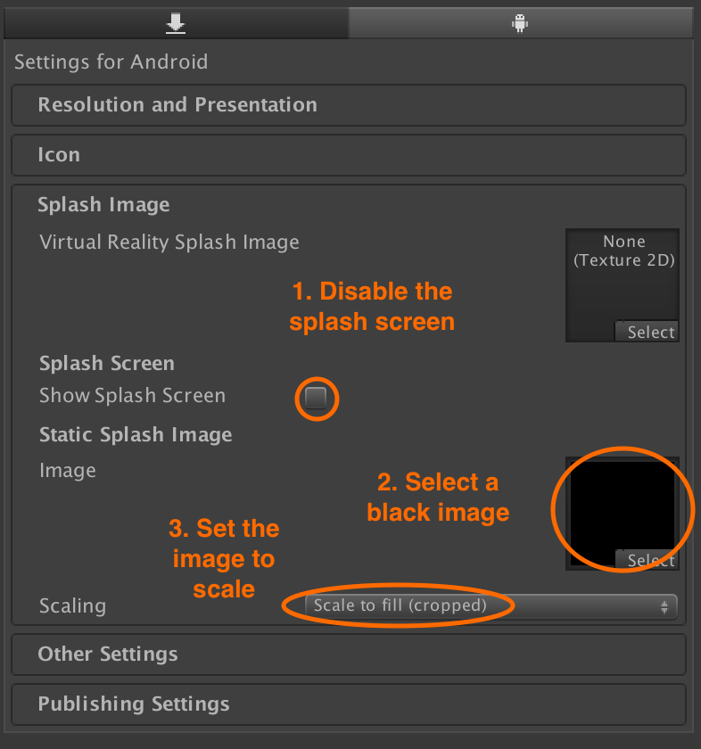
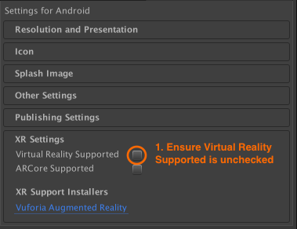
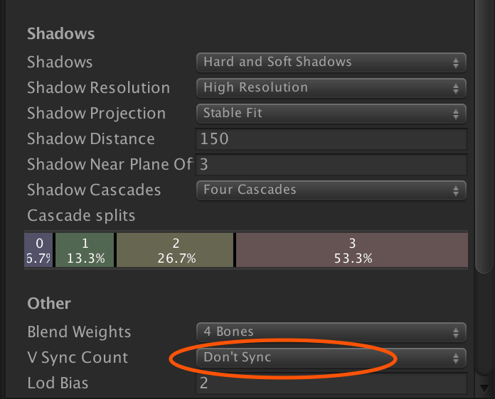

# Pico VR Unity SDK Installation

## Importing the unitypackage

The Pico Unity VR SDK comes as a .unitypackage that you can import into your project via the **Assets › Import Package › Custom Package...** menu option in Unity.

You can <a href="https://users.wearvr.com/developers/devices/pico-goblin/resources/vr-unity-package" target="_blank">download the Pico VR Unity SDK</a> from WEARVR. You will be asked to create or sign in to your developer account.

  

This will add a number of directories to your project:

  

Delete the existing `MainCamera` from your scene and drag the prefab `PicoMobileSDK/Pvr_UnitySDK/Prefabs/Pvr_UnitySDK.prefab` in to replace it. If necessary, reposition the new camera prefab to where the old one was.

  

## Differences between Unity versions

Unity2017.2.0 compilation requires setting target API level to Android 6.0. 

The project package name can be dependent on Player Setting or to AndroidManifest. In Unity 5.x it is dependent on AndroidManifest, and in Unity2017 or above is dependent on Player Setting.

There may exist difference of FPS frame rates between different Unity versions. If performing a Unity version upgrade it is worth testing any changes on device to ensure that the project has not been badly affected.

## Project settings

### Enable 32-Bit display buffer

Some games can only run normally when Use 32-bit Display Buffer in Player Settings is checked during integration. It is recommended that this be enabled wherever possible.

  

### Disable multi-threaded rendering

Open **Edit › Project Settings › Player**. In the Android tab, uncheck **Multithreaded Rendering**

When multi-thread rendering is active, the frame rate is improved, but there are restrictions on the use of multi-thread rendering that can cause unpredictable and unwanted behaviour. For this reason it is advised to have it disabled.

  

### Disable the splash screen

As the VR cameras only initialise after the splash screen has been displayed, the splash image does not display correctly in the headset.

If you are using the premium version of Unity, it is recommended to disable the splash screen and set the static splash image to a solid black image in **Project Settings**.

  

### Disable bundled Unity VR SDKs

Depending on the version of Unity you are using, the **Virtual Reality Supported** option can be found in **Other Settings** or **XR Settings**. Make sure it is **NOT** checked to avoid conflicts with the Pico VR SDK.

  

## Quality Settings

Open **Edit › Project Settings › Quality** and change the following settings:

### Turn off vertical sync

In the **Other** section, change **V sync Count** to **Don’t Sync**

  

## AndroidManifest.xml file

If your project does not already have a `Assets/Plugins/Android/AndroidManifest.xml` file, you can use the one installed by the Pico SDK unity package.

If you already have an `AndroidManifest.xml` file in your project, you will need to manually merge in the values found in the unity package's `AndroidManifest.xml`. Please do not allow Unity to automatically consolidate other AndroidManifest files with the file provided by Pico, as it rarely does so successfully.

The necessary parts of the Pico AndroidManifest,xml to implant into an existing manifest are:

Pico all-in-one VR projects import special meta-data, necessary for the app to be displayed properly.

`<meta-data android:name=" pvr.app.type " android:value="vr"/>`

`<meta-data android:name=" pvr.display.orientation " android:value="180"/>`

In Pico VR all-in-one projects, all Activity that require display must inherit.  

`com.unity3d.player.UnityPlayerNativeActivityPico`

Add necessary permissions.

`<uses-permission android:name="android.permission.WRITE_SETTINGS"/>` 

`<uses-permission android:name="android.permission.BLUETOOTH" />` 

`<uses-permission android:name="android.permission.BLUETOOTH_ADMIN" />` 

`<uses-permission android:name="android.permission.INJECT_EVENTS" />`

### Next: Camera setup and input

See [Camera & input module setup](/docs/pico-vr-camera-setup.md)
