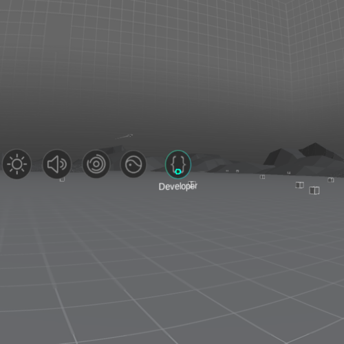

# Testing in-app purchases

## Prerequisites

To test your content's in-app purchases, you will need:

* A Pico Goblin that is [connected to a Wifi network](/docs/connecting-to-a-wifi-network.md) and has [developer mode enabled](/docs/pico-goblin-developer-mode-usb-debugging.md).
* Credentials for performing privileged actions on the Pico device (available by contacting `devs@wearvr.com`).
* Credentials for a test account on the Pico Chinese store (also available by contacting `devs@wearvr.com`).

## Changing the device's locale

On the Pico Goblin device's home screen, select the **Settings** option:

  

Select the **Developer** or **Advanced Options** menu item:

  

Scroll down to the **Developer Options** menu item and select it:

  

Scroll down and click on **Set Country Code**:

  

Click on the input box on the dialog that appears and enter the passphrase for your device (that WEARVR has given you) using the on-screen keyboard and select **OK**:

  

Click on the input box below **Set Country Code** (it may appear hidden) and enter **CN** using the on-screen keyboard. Then select **CN** from the drop-down

  

Your device is now set to use the Chinese Pico Store and is configured to use the Simplified Chinese language.

You will likely want to [change your language back to English](/docs/changing-pico-goblins-language-setting.md). You can use the button and menu item positions shown to navigate without needing to read Simplified Chinese.

You should now be ready to test your app's in-app purchases.

## Testing your app's in-app purchases

Ensure you are not already logged in to a user account on the device by checking the main menu displays the **Login** menu option to the right. If not, select the user account and proceed to sign out.

> It is not currently possible to wipe the test account's purchase history, so if your app has in-app purchases that are *not* consumable, you will get only one chance to test the successful purchase of your item. **Make sure you have adequate code and logging in place** to verify all that you need to before attempting to make the purchase.

Open your app and attempt to make an in-app purchase. A sign-in dialog should appear, where you can use the credentials that WEARVR have given you for a test account.

For a successful purchase, you should be returned to your app, with the purchased item now available.

## Next: Submitting your app

See [submitting your app](/Readme.md).

