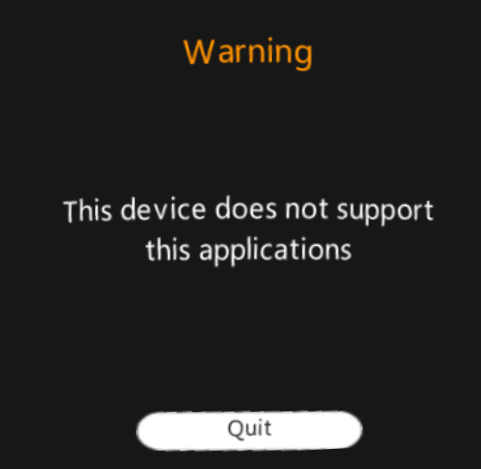
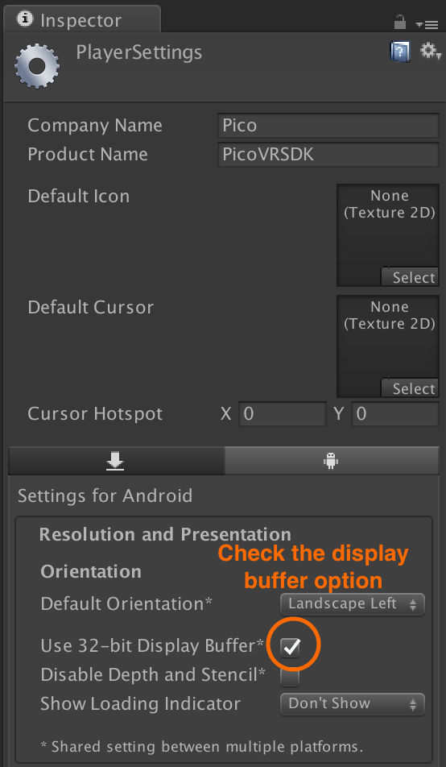
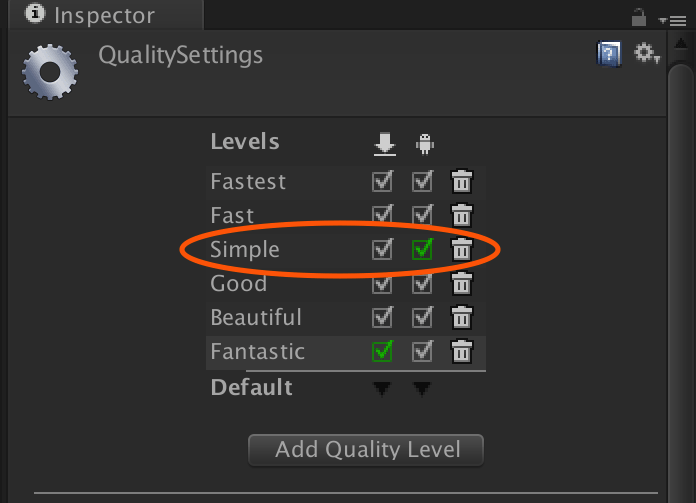
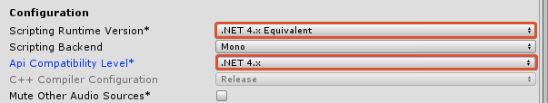

# Troubleshooting Pico VR

## Error: This device does not support this applications

If you get the following error when you attempt to run your experience on a Pico Goblin:

  

Check that you have the [camera set to three degrees of freedom](/docs/pico-vr-camera-setup.md#pico-goblin-3-degrees-of-freedom).

## Compilation problems

If your application behaves unusually when compiled, try checking the **Use 32-bit Display** buffer option in Player Settings.

  

## UGUI problems

If you are having trouble with **UGUI** and you’re using a version of Unity below Unity 5.3.5 P5, try updating to a compatible version or higher as outlined by your current Pico SDK documentation.

## Application freezes when minimised and reloaded

If you’re using a version of Unity below Unity v2017.1.1, and are using a Pico SDK v2.7.4 or above, some technical issues may be present when minimising your app. It is strongly reccomended that you update your app to run on a newer version of Unity, as specified by your current Pico SDK doumentation.

## Frame rate or performance issues

Try reducing the quality settings in **Edit › Project Settings › Quality**.

Check the Simple level in the Android column.

  

The documentation within the Pico SDK has a recommended range for what they consider acceptable ranges of frame-rate covered in their FAQ. They also document what they consider a reasonable amount of resources that their devices can consume before issues may start to arise.
As of Pico SDK v2.7.5 frame rates of 45+ frames per second are considered ideal, with 30 FPS being considered the minimum acceptable for a finished project.

## Quitting an application on my Goblin2 device causes a black screen when I try to reload

Please make sure that your headset is updated to the newest version. This was a common issue but was solved with the 2.7.7 version of the Pico SDK. Some headsets distributed to developers may not yet be updated.

Another reason for this issue to appear is because of incompatible .NET versions. 
In **'Player Settings > Other Settings > Configuration'** change **'Scripting Runtime Version'** to '.Net 4.x Equivalent', and **'API Compatibility Level'** to .NET 4x.

  

## Rotating my head 45 degrees to the left or right causes eye flickering issues.

Please ensure that your applications default orientation is set to 'Landscape Left' in **'Player Settings > Resolution and Presentation > Orientation > Default Orientation'**
Please also ensure that no code is changing this orientation.
Within the Pico SDK changing the orientation to anything else will cause visual issues, which may persist even if the orientation is corrected afterwards.
