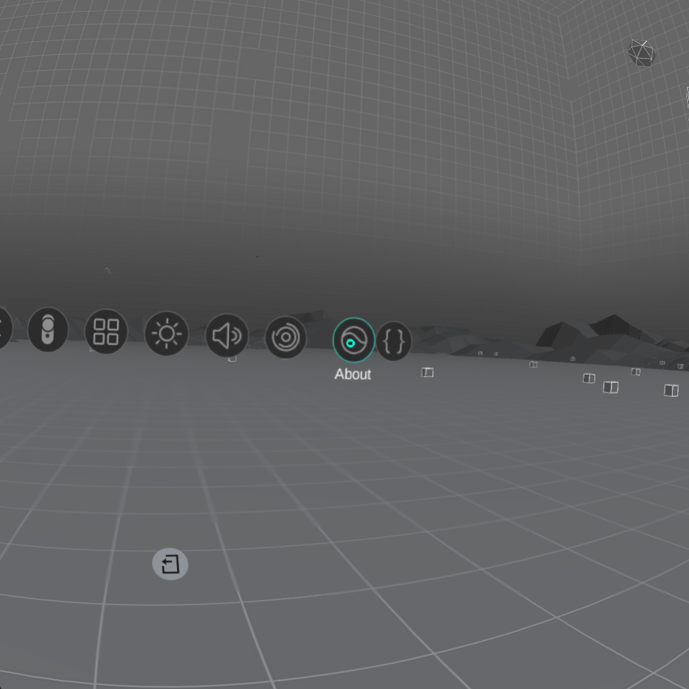
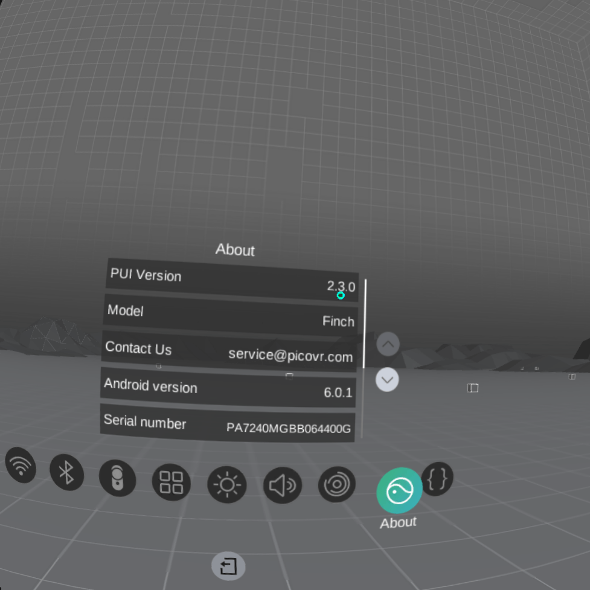
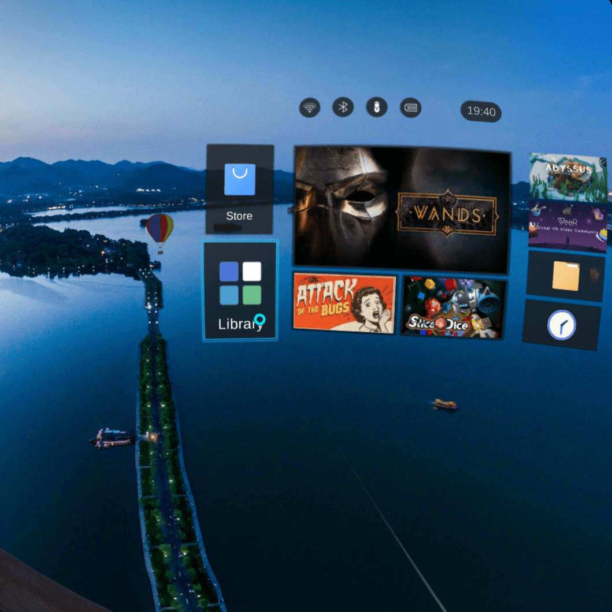
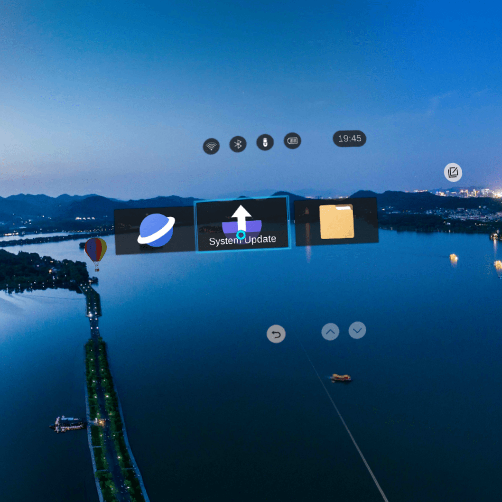
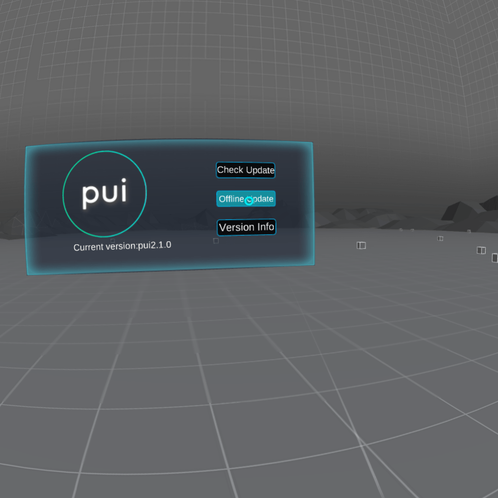
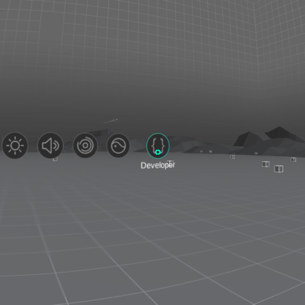
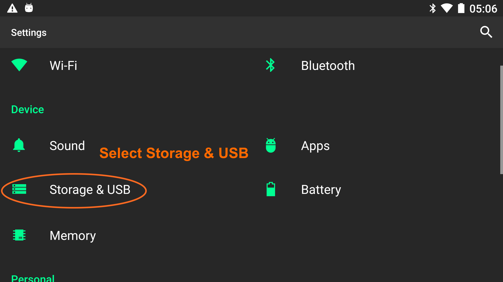
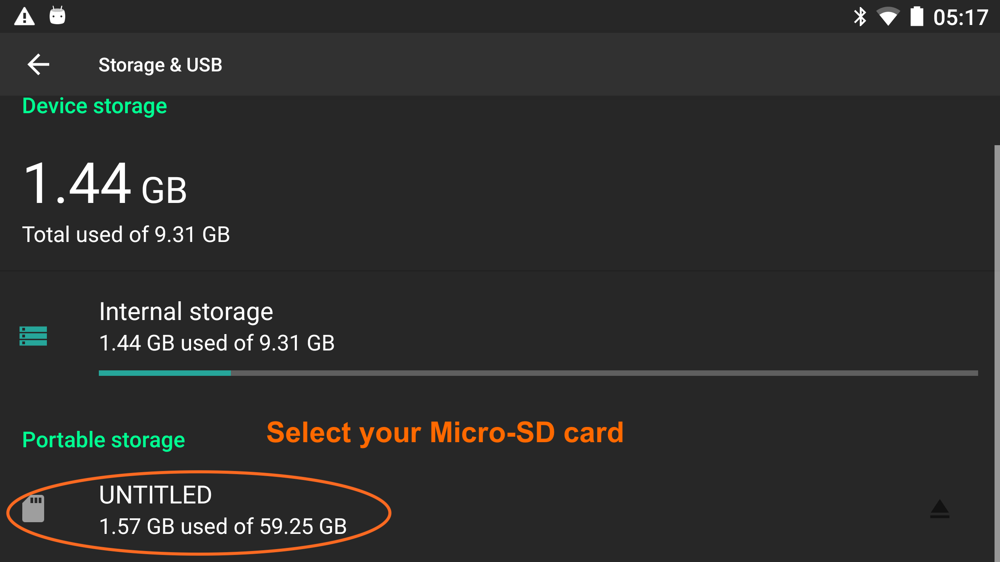

# Upgrading Pico Goblin operating system firmware

Currently the latest version of the Pico Goblin OS is 2.3.0. This is the lowest version of the OS your app will need to support.

## Prerequisites

To upgrade a Pico Goblin device's operating system and firmware, you will need:

* A Pico Goblin device that is *fully charged*
* A Micro-SD card 1GB or larger, formatted as FAT32
* A computer to download the file and place it on the Micro-SD card
* A WEARVR developer account

## Checking the current Pico OS version

On the Pico Goblin device's home screen, select the **Settings** option on the right of the screen:

  

Select **About** from the settings options:

  

View the **PUI Version**:

  

Compare the PUI Version to [latest version of the Pico Goblin operation system available](https://users.wearvr.com/developers/devices/pico-goblin/resources/firmware).

## Upgrade instructions

If you have not already, download the [latest version of the Pico Goblin operation system and firmware](https://users.wearvr.com/developers/devices/pico-goblin/resources/firmware).

**Do not** extract the .zip file and do not rename it.

Check that your Micro-SD has been formatted using FAT32. If not, re-format it using your tool of choice.

Create a folder at the root of your Micro-SD card called `dload`.

Move the .zip file you just downloaded into this folder.

Eject the Micro-SD card and push it into the Micro-SD slot at the bottom of the Pico Goblin headset until you hear a click. Be careful to correctly orient the SD card: it should not stick out at all once it has been fully inserted.

Select the **Libary** menu option:

  

Open the **System Update** app:

  

> Do **not** press the power button or remove the Micro-SD until the upgrade is complete or you may damage the device.

Select the **Offline Update** option and follow the instructions.

  

Once the device has updated and restarted, you now have the latest version of the Pico VR operating system and firmware installed.

You can now remove the Micro-SD card from the headset.

## Troubleshooting

If the device does not detect the updated operating system file on the Micro-SD, check that the file has its original name and is a directory called `dload`, at the root of the Micro-SD card's file system.

If that has no effect, try the following steps:

Open settings:

  

Select the **Developer** or **Advanced Options**:

  

Select the **Storage & USB**:

  

Select the Micro-SD card:

  

Navigate to the `dload` directory. If there are two files that appear in that directory with the same name, delete the one with the smaller size (usually around 4kb).

Re-attempt the instructions above.
